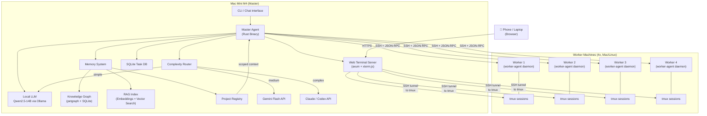
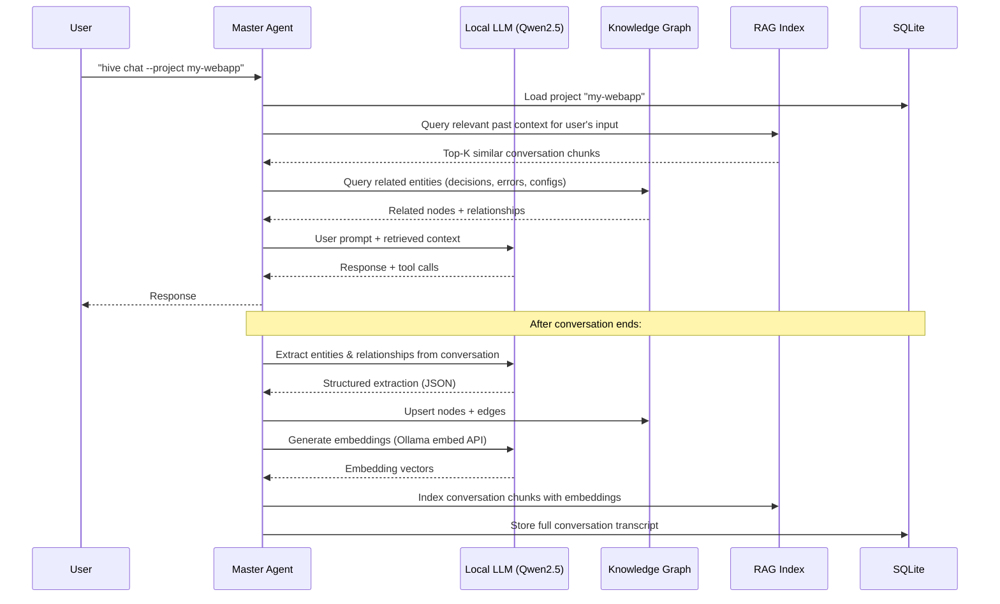
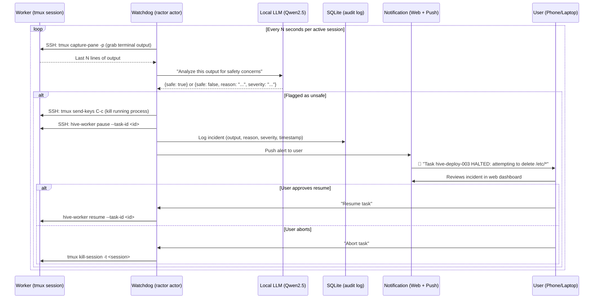

# Distributed Agentic System — Implementation Plan

## Goal
Build a **self-hosted, distributed agentic system** where a master agent on a Mac Mini M4 (16GB) runs a local LLM, plans tasks, assesses complexity, and either handles them locally or delegates them to 4 worker machines via SSH. Delegated tasks run in tmux sessions accessible from a phone/laptop through a web terminal UI. The master agent routes complex subtasks to cloud AI services (Claude, Gemini, Codex) when the local model isn't sufficient.

Every conversation is **scoped to a project**, and all interactions are automatically indexed into a **knowledge graph + RAG pipeline** using the local LLM. This gives the agent persistent, project-aware memory — so when you revisit a project weeks later, it can recall past decisions, commands, errors, and context without you re-explaining anything.

---

## Architecture Overview



---

## User Review Required

> [!IMPORTANT]
> **Security Model**: The web terminal will be exposed on your LAN. The plan includes basic auth (username/password) and optional HTTPS via self-signed certs. If you ever expose this outside your LAN (e.g., via Tailscale), we should add stronger auth (TOTP, client certs). Is LAN-only access sufficient for now?

> [!IMPORTANT]
> **Project Location**: I'll create this project at `~/hive/` (the project name — see naming below). Let me know if you'd prefer a different location.

> [!WARNING]
> **Cloud API Costs**: The complexity router will auto-send tasks to Claude/Gemini/Codex. There are no spending caps by default. Should I add a daily cost limit or require confirmation for cloud API calls above a threshold?

---

## Open Questions

> [!IMPORTANT]
> 1. **Worker machine details**: Can you share the hostnames/IPs and SSH usernames for your 4 workers? (I'll template them for now and you can fill in later.)
> 2. **Fine-tuning data**: For LoRA fine-tuning, do you have existing conversation logs, command histories, or task examples you want to train on? Or will we build up the dataset over time from usage?
> 3. **Project name preference**: I'm proposing **"Hive"** as the project name (master = queen, workers = drones). Open to alternatives.

---

## Technology Stack

| Component | Technology | Rationale |
|:---|:---|:---|
| **Language** | Rust (primary), TypeScript (web terminal frontend) | User preference; Scenario A from research fits perfectly |
| **Agent Framework** | `rig-core` + `genai` | Best Rust agent framework; unified multi-provider LLM client |
| **Actor Model** | `ractor` | Erlang-style supervision for agent state machines and failure recovery |
| **Local LLM** | **Qwen2.5-14B-Instruct Q4_K_M** via **Ollama** | Best agentic model under 10GB; native tool calling; 14-16 tps on M4 |
| **Cloud LLMs** | Claude (Anthropic), Gemini Flash (Google), Codex (OpenAI) | Tiered routing by complexity |
| **SSH** | `openssh-rs` | Inherits `~/.ssh/config`; ControlMaster multiplexing for instant connections |
| **tmux** | `tmux_interface` + custom wrappers | Typed builder pattern for session management |
| **Web Terminal** | `axum` (WebSocket) + `xterm.js` | Industry-standard Rust web terminal stack |
| **Task Queue** | `apalis` with SQLite backend | Lightweight, no Redis needed; built-in retries and cron |
| **Database** | SQLite via `rusqlite` | Task history, skill definitions, fine-tuning data collection |
| **Tool Schemas** | `schemars` + `serde` | JSON Schema derivation from Rust types for LLM tool calling |

---

## Proposed Changes

### Phase 1: Project Scaffold & Core Agent Loop

#### [NEW] `~/hive/Cargo.toml` — Workspace root

```toml
[workspace]
resolver = "2"
members = [
    "hive-core",      # Master agent logic, LLM routing, tool system
    "hive-worker",    # Lightweight daemon for worker machines
    "hive-web",       # Web terminal server
    "hive-cli",       # CLI interface to interact with the master
    "hive-common",    # Shared types, protocols, error types
]

[workspace.dependencies]
tokio = { version = "1", features = ["full"] }
serde = { version = "1", features = ["derive"] }
serde_json = "1"
tracing = "0.1"
tracing-subscriber = { version = "0.3", features = ["env-filter"] }
anyhow = "1"
thiserror = "2"
```

#### [NEW] `hive-common/` — Shared protocol types

Defines the JSON-RPC protocol between master and workers:

```rust
// hive-common/src/protocol.rs

use serde::{Deserialize, Serialize};

/// A task assignment sent from master to worker
#[derive(Debug, Clone, Serialize, Deserialize)]
pub struct TaskAssignment {
    pub task_id: String,
    pub description: String,
    pub commands: Vec<TaskCommand>,
    pub tmux_session_name: String,
    pub priority: TaskPriority,
    pub ai_context: Option<AiContext>,
}

/// Individual command to execute
#[derive(Debug, Clone, Serialize, Deserialize)]
pub struct TaskCommand {
    pub command: String,
    pub working_dir: Option<String>,
    pub env_vars: HashMap<String, String>,
    pub timeout_secs: Option<u64>,
}

/// AI context for when the worker needs to make sub-decisions
#[derive(Debug, Clone, Serialize, Deserialize)]
pub struct AiContext {
    pub provider: AiProvider,
    pub system_prompt: String,
    pub max_tokens: u32,
}

#[derive(Debug, Clone, Serialize, Deserialize)]
pub enum AiProvider {
    Local,          // Ollama on Mac Mini
    GeminiFlash,    // Medium complexity
    Claude,         // High complexity
    Codex,          // Code-specific
}

#[derive(Debug, Clone, Serialize, Deserialize)]
pub enum TaskPriority { Low, Normal, High, Critical }

/// Status report from worker back to master
#[derive(Debug, Clone, Serialize, Deserialize)]
pub struct TaskStatus {
    pub task_id: String,
    pub state: TaskState,
    pub output: Option<String>,
    pub error: Option<String>,
    pub tmux_session: Option<String>,
}

#[derive(Debug, Clone, Serialize, Deserialize)]
pub enum TaskState {
    Queued,
    Running,
    WaitingForDecision,  // Worker needs master's AI to decide next step
    Completed,
    Failed,
}
```

---

### Phase 2: Master Agent — LLM Integration & Complexity Router

#### [NEW] `hive-core/src/llm/mod.rs` — Multi-provider LLM client

```rust
// Unified LLM interface using `genai` for provider abstraction

pub struct LlmRouter {
    local: OllamaClient,       // Qwen2.5-14B on localhost:11434
    gemini: GeminiClient,      // Gemini Flash for medium tasks
    claude: ClaudeClient,      // Claude for complex tasks
    codex: OpenAiClient,       // Codex for code tasks
}

impl LlmRouter {
    /// Assess task complexity and route to appropriate provider
    pub async fn route_and_execute(&self, task: &TaskPlan) -> Result<LlmResponse> {
        let complexity = self.assess_complexity(task).await?;
        
        match complexity {
            Complexity::Simple => self.local.complete(task).await,
            Complexity::Medium => self.gemini.complete(task).await,
            Complexity::Complex => self.claude.complete(task).await,
            Complexity::CodeHeavy => self.codex.complete(task).await,
        }
    }

    /// Use local model to classify task complexity
    async fn assess_complexity(&self, task: &TaskPlan) -> Result<Complexity> {
        let classification_prompt = format!(
            "Classify this task's complexity as SIMPLE, MEDIUM, COMPLEX, or CODE_HEAVY.\n\
             Task: {}\n\
             Rules:\n\
             - SIMPLE: single command, file operation, status check\n\
             - MEDIUM: multi-step but straightforward (install, configure, deploy)\n\
             - COMPLEX: requires deep reasoning, multi-file refactoring, debugging\n\
             - CODE_HEAVY: writing or modifying significant code\n\
             Respond with ONLY the classification.",
            task.description
        );
        // Local model classifies — this is fast and free
        let response = self.local.complete_raw(&classification_prompt).await?;
        Complexity::from_str(&response)
    }
}
```

#### [NEW] `hive-core/src/agent/mod.rs` — Core agent loop (ReAct pattern)

```rust
/// The master agent's main reasoning loop
pub struct MasterAgent {
    llm: LlmRouter,
    tools: ToolRegistry,
    workers: WorkerPool,
    task_db: TaskDatabase,
    skills: SkillRegistry,
}

impl MasterAgent {
    pub async fn handle_request(&self, user_input: &str) -> Result<AgentResponse> {
        // 1. Plan: Use LLM to decompose the task
        let plan = self.plan_task(user_input).await?;
        
        // 2. For each sub-task, decide: local execution or delegate?
        for subtask in &plan.subtasks {
            if subtask.requires_remote {
                // Pick least-loaded worker
                let worker = self.workers.select_worker().await?;
                let assignment = self.create_assignment(subtask, &worker).await?;
                
                // Delegate via SSH
                worker.assign_task(assignment).await?;
            } else {
                // Execute locally using tool system
                self.execute_locally(subtask).await?;
            }
        }
        
        // 3. Return summary with tmux session access info
        Ok(AgentResponse {
            summary: plan.summary,
            sessions: self.workers.active_sessions().await?,
        })
    }
}
```

---

### Phase 3: Worker Management & SSH Delegation

#### [NEW] `hive-core/src/workers/pool.rs` — Worker pool with load balancing

```rust
use openssh::{Session, KnownHosts};

pub struct WorkerPool {
    workers: Vec<WorkerNode>,
}

pub struct WorkerNode {
    pub name: String,
    pub host: String,         // e.g., "worker1.local" or "192.168.1.x"
    pub user: String,
    pub ssh_session: Option<Session>,
    pub active_tasks: AtomicUsize,
    pub status: WorkerStatus,
}

impl WorkerPool {
    /// Round-robin with least-connections load balancing
    pub async fn select_worker(&self) -> Result<&WorkerNode> {
        self.workers
            .iter()
            .filter(|w| w.status == WorkerStatus::Online)
            .min_by_key(|w| w.active_tasks.load(Ordering::Relaxed))
            .ok_or(anyhow!("No workers available"))
    }

    /// Delegate a task to a worker via SSH
    pub async fn delegate(&self, worker: &WorkerNode, task: TaskAssignment) -> Result<String> {
        let session = Session::connect_mux(&worker.host, KnownHosts::Accept).await?;
        
        // 1. Create tmux session on the remote machine
        let tmux_name = format!("hive-{}", task.task_id);
        session.command("tmux")
            .args(["new-session", "-d", "-s", &tmux_name])
            .status().await?;
        
        // 2. Send the task payload to the worker daemon
        let payload = serde_json::to_string(&task)?;
        session.command("hive-worker")
            .args(["execute", "--task", &payload])
            .status().await?;
        
        Ok(tmux_name)
    }
}
```

#### [NEW] `hive-worker/src/main.rs` — Lightweight worker daemon

```rust
/// Worker daemon that runs on each worker machine.
/// Receives tasks from master, executes in tmux, reports status.

#[tokio::main]
async fn main() -> Result<()> {
    let config = WorkerConfig::load()?;
    
    // Start a small HTTP server for health checks & task reception
    let app = Router::new()
        .route("/health", get(health_check))
        .route("/task", post(receive_task))
        .route("/status/:task_id", get(task_status));
    
    let listener = TcpListener::bind(&config.listen_addr).await?;
    axum::serve(listener, app).await?;
    Ok(())
}

async fn receive_task(Json(task): Json<TaskAssignment>) -> impl IntoResponse {
    // Execute commands in the tmux session
    for cmd in &task.commands {
        // Send command to the tmux session
        tmux_send_keys(&task.tmux_session_name, &cmd.command).await?;
    }
    
    Json(TaskStatus {
        task_id: task.task_id,
        state: TaskState::Running,
        ..Default::default()
    })
}
```

---

### Phase 4: Web Terminal (Phone/Laptop Access)

#### [NEW] `hive-web/` — Web-based terminal server

The web terminal runs on the Mac Mini and proxies tmux sessions from any worker machine.

```
hive-web/
├── src/
│   ├── main.rs          # axum server with WebSocket endpoint
│   ├── auth.rs          # Basic auth middleware
│   ├── terminal.rs      # PTY/SSH-to-WebSocket bridge
│   └── session_list.rs  # List active tmux sessions across all workers
├── static/
│   ├── index.html       # Session picker UI
│   ├── terminal.html    # xterm.js terminal page
│   └── js/
│       └── xterm.js     # xterm.js bundle
```

**Key flow:**
1. User opens `http://mac-mini.local:8080` on phone
2. Sees a dashboard of all active tmux sessions across all workers
3. Clicks a session → WebSocket connection opens
4. Backend SSHes into the worker, attaches to the tmux session
5. Bidirectional PTY stream flows: `browser ↔ WebSocket ↔ SSH ↔ tmux`

```rust
// hive-web/src/terminal.rs — WebSocket-to-SSH-tmux bridge

pub async fn ws_handler(
    ws: WebSocketUpgrade,
    Path(session_id): Path<String>,
    State(state): State<AppState>,
) -> impl IntoResponse {
    ws.on_upgrade(move |socket| handle_terminal(socket, session_id, state))
}

async fn handle_terminal(mut socket: WebSocket, session_id: String, state: AppState) {
    // Find which worker owns this session
    let worker = state.find_session_worker(&session_id).await.unwrap();
    
    // SSH into the worker and attach to tmux
    let session = Session::connect_mux(&worker.host, KnownHosts::Accept).await.unwrap();
    let mut child = session.command("tmux")
        .args(["attach-session", "-t", &session_id])
        .spawn().await.unwrap();
    
    // Bidirectional stream: WebSocket ↔ SSH stdin/stdout
    let (mut ws_tx, mut ws_rx) = socket.split();
    let mut stdout = child.stdout().take().unwrap();
    let mut stdin = child.stdin().take().unwrap();
    
    tokio::select! {
        // Worker → Browser
        _ = async {
            let mut buf = [0u8; 4096];
            loop {
                let n = stdout.read(&mut buf).await.unwrap();
                if n == 0 { break; }
                ws_tx.send(Message::Binary(buf[..n].to_vec())).await.unwrap();
            }
        } => {},
        // Browser → Worker
        _ = async {
            while let Some(Ok(msg)) = ws_rx.next().await {
                if let Message::Binary(data) | Message::Text(data) = msg {
                    stdin.write_all(data.as_bytes()).await.unwrap();
                }
            }
        } => {},
    }
}
```

---

### Phase 5: Skill & Plugin System

#### [NEW] `hive-core/src/skills/` — Extensible skill system

Skills are defined as TOML files + optional scripts:

```
~/.hive/skills/
├── deploy_service/
│   ├── skill.toml        # Metadata, triggers, parameters
│   ├── system_prompt.md   # Custom system prompt for this skill
│   └── scripts/
│       └── deploy.sh      # Helper script
├── git_workflow/
│   ├── skill.toml
│   └── system_prompt.md
└── custom_monitor/
    ├── skill.toml
    └── scripts/
        └── check_health.py
```

```toml
# ~/.hive/skills/deploy_service/skill.toml

[skill]
name = "deploy_service"
description = "Deploy a service to a target machine"
version = "1.0.0"

[trigger]
# Natural language patterns that activate this skill
patterns = ["deploy", "push to production", "release"]

[parameters]
service_name = { type = "string", required = true }
target_env = { type = "string", default = "staging", options = ["staging", "production"] }
branch = { type = "string", default = "main" }

[execution]
# Which AI provider to use for this skill's reasoning
ai_provider = "claude"  # Complex deployment reasoning
# Whether to require user confirmation before executing
require_confirmation = true
```

```rust
// hive-core/src/skills/registry.rs

pub struct SkillRegistry {
    skills: HashMap<String, Skill>,
    skill_dir: PathBuf,  // ~/.hive/skills/
}

impl SkillRegistry {
    /// Load all skills from disk
    pub fn load_from_dir(dir: &Path) -> Result<Self> { ... }
    
    /// Match user input to a skill using pattern matching + LLM
    pub async fn match_skill(&self, input: &str, llm: &LlmRouter) -> Option<&Skill> { ... }
    
    /// Convert a skill into LLM tool definitions
    pub fn to_tool_definitions(&self) -> Vec<ToolDefinition> { ... }
}
```

---

### Phase 6: Fine-Tuning Pipeline

#### [NEW] `hive-core/src/finetune/` — Data collection & LoRA training

```rust
// hive-core/src/finetune/collector.rs

/// Automatically collects training data from successful agent interactions
pub struct DataCollector {
    db: TaskDatabase,
}

impl DataCollector {
    /// Log a successful interaction as training data
    pub async fn log_interaction(&self, interaction: &Interaction) -> Result<()> {
        // Store in SQLite: input, reasoning chain, tool calls, output
        self.db.insert_training_example(
            &interaction.user_input,
            &interaction.agent_reasoning,
            &interaction.tool_calls,
            &interaction.final_output,
            interaction.was_successful,
        ).await
    }
    
    /// Export collected data in Alpaca/ShareGPT format for fine-tuning
    pub async fn export_dataset(&self, format: DatasetFormat, path: &Path) -> Result<()> {
        let examples = self.db.get_successful_interactions().await?;
        match format {
            DatasetFormat::Alpaca => export_alpaca(&examples, path)?,
            DatasetFormat::ShareGPT => export_sharegpt(&examples, path)?,
            DatasetFormat::ChatML => export_chatml(&examples, path)?,
        }
        Ok(())
    }
}
```

Fine-tuning will be done using **Unsloth** or **MLX-LM** (both excellent on Apple Silicon):

```bash
# Export training data
hive finetune export --format sharegpt --output ~/hive-training-data.json

# Fine-tune with Unsloth (QLoRA, 4-bit, fits in 16GB)
python -m unsloth.train \
  --model "unsloth/Qwen2.5-14B-Instruct-bnb-4bit" \
  --dataset ~/hive-training-data.json \
  --output ~/hive-models/qwen2.5-14b-hive-lora \
  --lora_r 16 --lora_alpha 32 \
  --epochs 3 --batch_size 1

# Merge LoRA weights and convert to GGUF for Ollama
python -m unsloth.merge_and_export \
  --model ~/hive-models/qwen2.5-14b-hive-lora \
  --export_format gguf --quant q4_k_m

# Import into Ollama
ollama create hive-agent -f ~/hive-models/Modelfile
```

---

### Phase 7: CLI Interface

#### [NEW] `hive-cli/src/main.rs`

```rust
use clap::{Parser, Subcommand};

#[derive(Parser)]
#[command(name = "hive", about = "Distributed agentic task system")]
struct Cli {
    #[command(subcommand)]
    command: Commands,
}

#[derive(Subcommand)]
enum Commands {
    /// Start interactive chat with the master agent
    Chat,
    
    /// Submit a task directly
    Task {
        #[arg(short, long)]
        description: String,
    },
    
    /// List active sessions across all workers
    Sessions,
    
    /// Attach to a specific tmux session (via local terminal)
    Attach {
        session_id: String,
    },
    
    /// Manage worker machines
    Workers {
        #[command(subcommand)]
        action: WorkerAction,
    },
    
    /// Manage skills
    Skills {
        #[command(subcommand)]
        action: SkillAction,
    },
    
    /// Fine-tuning data management
    Finetune {
        #[command(subcommand)]
        action: FinetuneAction,
    },
    
    /// Start the web terminal server
    Serve {
        #[arg(short, long, default_value = "0.0.0.0:8080")]
        bind: String,
    },
}
```

**Example usage:**
```bash
# Interactive chat
$ hive chat
🐝 Hive Agent Ready. What would you like to do?
> Deploy the latest version of my web app to all workers and run tests

Planning task...
├── Complexity: MEDIUM → Routing to Gemini Flash
├── Subtasks:
│   ├── [Worker 1] git pull & build (tmux: hive-deploy-001)
│   ├── [Worker 2] git pull & build (tmux: hive-deploy-002)  
│   ├── [Worker 3] git pull & build (tmux: hive-deploy-003)
│   └── [Worker 4] run test suite (tmux: hive-test-001)
└── Access sessions at http://mac-mini.local:8080

# List sessions
$ hive sessions
SESSION ID          WORKER      STATUS    CREATED
hive-deploy-001     worker-1    running   2 min ago
hive-deploy-002     worker-2    running   2 min ago
hive-deploy-003     worker-3    complete  1 min ago
hive-test-001       worker-4    running   1 min ago

# Quick task
$ hive task -d "check disk space on all machines"
```

---

### Phase 9: Conversation Memory, Knowledge Graph & Project Scoping

This is the system that gives Hive **persistent, project-aware memory**. Every conversation is indexed so the agent can recall past context.

#### How it works — end to end



#### Data Model

```sql
-- Projects table
CREATE TABLE projects (
    id TEXT PRIMARY KEY,
    name TEXT NOT NULL UNIQUE,
    description TEXT,
    created_at TIMESTAMP DEFAULT CURRENT_TIMESTAMP,
    last_accessed TIMESTAMP
);

-- Conversations scoped to projects
CREATE TABLE conversations (
    id TEXT PRIMARY KEY,
    project_id TEXT NOT NULL REFERENCES projects(id),
    title TEXT,              -- Auto-generated summary
    started_at TIMESTAMP DEFAULT CURRENT_TIMESTAMP,
    ended_at TIMESTAMP,
    message_count INTEGER DEFAULT 0,
    status TEXT DEFAULT 'active'  -- active, completed, archived
);

-- Individual messages within a conversation
CREATE TABLE messages (
    id TEXT PRIMARY KEY,
    conversation_id TEXT NOT NULL REFERENCES conversations(id),
    role TEXT NOT NULL,       -- user, assistant, tool_call, tool_result
    content TEXT NOT NULL,
    metadata JSON,           -- tool names, task IDs, worker info
    created_at TIMESTAMP DEFAULT CURRENT_TIMESTAMP
);

-- Knowledge Graph nodes
CREATE TABLE kg_nodes (
    id TEXT PRIMARY KEY,
    project_id TEXT NOT NULL REFERENCES projects(id),
    entity_type TEXT NOT NULL,  -- decision, error, config, command, dependency, person, service
    name TEXT NOT NULL,
    description TEXT,
    properties JSON,            -- flexible key-value metadata
    source_conversation TEXT REFERENCES conversations(id),
    created_at TIMESTAMP,
    updated_at TIMESTAMP
);

-- Knowledge Graph edges (relationships)
CREATE TABLE kg_edges (
    id TEXT PRIMARY KEY,
    source_node TEXT NOT NULL REFERENCES kg_nodes(id),
    target_node TEXT NOT NULL REFERENCES kg_nodes(id),
    relationship TEXT NOT NULL,  -- caused_by, resolved_by, depends_on, configured_in, deployed_to
    weight REAL DEFAULT 1.0,
    source_conversation TEXT REFERENCES conversations(id),
    created_at TIMESTAMP
);

-- RAG vector index (embeddings stored as BLOBs, searched via exact/approx scan)
CREATE TABLE embeddings (
    id TEXT PRIMARY KEY,
    conversation_id TEXT NOT NULL REFERENCES conversations(id),
    project_id TEXT NOT NULL REFERENCES projects(id),
    chunk_text TEXT NOT NULL,         -- The original text chunk
    chunk_index INTEGER,             -- Position in conversation
    embedding BLOB NOT NULL,         -- f32 vector serialized as bytes
    metadata JSON,                   -- message_ids, timestamps
    created_at TIMESTAMP
);

-- Full-text search index for fast keyword lookup
CREATE VIRTUAL TABLE messages_fts USING fts5(content, content=messages, content_rowid=rowid);
```

#### [NEW] `hive-core/src/memory/mod.rs` — Memory system orchestrator

```rust
pub mod knowledge_graph;
pub mod rag;
pub mod projects;
pub mod extractor;

use crate::llm::LlmRouter;

/// The unified memory system — queries KG + RAG to build context
pub struct MemorySystem {
    pub kg: KnowledgeGraph,
    pub rag: RagIndex,
    pub projects: ProjectRegistry,
    db: SqlitePool,
}

impl MemorySystem {
    /// Retrieve relevant context for a new user message within a project
    pub async fn retrieve_context(
        &self,
        project_id: &str,
        user_input: &str,
        max_tokens: usize,
    ) -> Result<RetrievedContext> {
        // 1. Vector similarity search across past conversation chunks
        let rag_results = self.rag.search(project_id, user_input, 10).await?;
        
        // 2. Extract key entities from the query, then traverse the KG
        let query_entities = self.kg.extract_entities_from_query(user_input).await?;
        let kg_results = self.kg.query_related(project_id, &query_entities, 2).await?;
        
        // 3. Get recent conversation history for this project
        let recent = self.projects.recent_messages(project_id, 20).await?;
        
        // 4. Merge, deduplicate, and rank by relevance, then trim to fit max_tokens
        Ok(RetrievedContext::merge_and_rank(rag_results, kg_results, recent, max_tokens))
    }
    
    /// Index a completed conversation into KG + RAG
    pub async fn index_conversation(
        &self,
        conversation_id: &str,
        llm: &LlmRouter,
    ) -> Result<IndexingResult> {
        let messages = self.db.get_conversation_messages(conversation_id).await?;
        
        // 1. Extract entities and relationships using local LLM
        let extraction = self.extract_knowledge(llm, &messages).await?;
        self.kg.upsert_nodes(&extraction.entities).await?;
        self.kg.upsert_edges(&extraction.relationships).await?;
        
        // 2. Chunk conversation and generate embeddings
        let chunks = self.chunk_conversation(&messages);
        let embeddings = self.generate_embeddings(llm, &chunks).await?;
        self.rag.index_chunks(&chunks, &embeddings).await?;
        
        // 3. Auto-generate conversation title/summary
        let summary = llm.local.complete_raw(&format!(
            "Summarize this conversation in one sentence:\n{}",
            messages.iter().map(|m| format!("{}: {}", m.role, m.content)).collect::<Vec<_>>().join("\n")
        )).await?;
        self.db.set_conversation_title(conversation_id, &summary).await?;
        
        Ok(IndexingResult {
            entities_added: extraction.entities.len(),
            edges_added: extraction.relationships.len(),
            chunks_indexed: chunks.len(),
        })
    }
}
```

#### [NEW] `hive-core/src/memory/extractor.rs` — LLM-powered knowledge extraction

```rust
/// Uses the local LLM to extract structured knowledge from conversations
pub struct KnowledgeExtractor;

impl KnowledgeExtractor {
    /// Extract entities and relationships from a conversation
    pub async fn extract(
        llm: &LlmRouter,
        messages: &[Message],
    ) -> Result<ExtractionResult> {
        let prompt = format!(r#"
Analyze this conversation and extract structured knowledge.

CONVERSATION:
{}

Extract the following as JSON:
{{
  "entities": [
    {{
      "type": "decision|error|config|command|dependency|service|file|concept",
      "name": "short identifier",
      "description": "what this entity represents",
      "properties": {{}}
    }}
  ],
  "relationships": [
    {{
      "source": "entity name",
      "target": "entity name",
      "relationship": "caused_by|resolved_by|depends_on|configured_in|deployed_to|related_to"
    }}
  ]
}}

Focus on actionable knowledge: decisions made, errors encountered, 
configurations set, commands that worked/failed, dependencies discovered.
"#, format_messages(messages));

        let response = llm.local.complete_raw(&prompt).await?;
        serde_json::from_str(&response).map_err(Into::into)
    }
}
```

#### [NEW] `hive-core/src/memory/rag.rs` — Vector search using Ollama embeddings

```rust
/// RAG index using Ollama's embedding API + SQLite storage
pub struct RagIndex {
    db: SqlitePool,
    ollama_url: String,
    embed_model: String,  // e.g., "nomic-embed-text" or "qwen2.5:14b"
}

impl RagIndex {
    /// Generate embeddings via Ollama's /api/embed endpoint
    async fn embed(&self, texts: &[String]) -> Result<Vec<Vec<f32>>> {
        let client = reqwest::Client::new();
        let resp = client.post(format!("{}/api/embed", self.ollama_url))
            .json(&serde_json::json!({
                "model": self.embed_model,
                "input": texts,
            }))
            .send().await?
            .json::<EmbedResponse>().await?;
        Ok(resp.embeddings)
    }

    /// Search for similar chunks within a project
    pub async fn search(
        &self,
        project_id: &str,
        query: &str,
        top_k: usize,
    ) -> Result<Vec<RagResult>> {
        let query_embedding = self.embed(&[query.to_string()]).await?[0].clone();
        
        // Load all embeddings for this project and compute cosine similarity
        // (For <10K chunks, brute-force is fast enough; can upgrade to HNSW later)
        let chunks = self.db.get_project_embeddings(project_id).await?;
        
        let mut scored: Vec<_> = chunks.iter()
            .map(|chunk| {
                let sim = cosine_similarity(&query_embedding, &chunk.embedding);
                (sim, chunk)
            })
            .collect();
        
        scored.sort_by(|a, b| b.0.partial_cmp(&a.0).unwrap());
        scored.truncate(top_k);
        
        Ok(scored.into_iter().map(|(score, chunk)| RagResult {
            text: chunk.chunk_text.clone(),
            score,
            conversation_id: chunk.conversation_id.clone(),
        }).collect())
    }
}

fn cosine_similarity(a: &[f32], b: &[f32]) -> f32 {
    let dot: f32 = a.iter().zip(b).map(|(x, y)| x * y).sum();
    let norm_a: f32 = a.iter().map(|x| x * x).sum::<f32>().sqrt();
    let norm_b: f32 = b.iter().map(|x| x * x).sum::<f32>().sqrt();
    dot / (norm_a * norm_b + 1e-8)
}
```

#### [NEW] `hive-core/src/memory/projects.rs` — Project registry & scoping

```rust
/// Manages project definitions and scoped conversations
pub struct ProjectRegistry {
    db: SqlitePool,
}

impl ProjectRegistry {
    /// Create a new project
    pub async fn create(&self, name: &str, description: Option<&str>) -> Result<Project> { ... }
    
    /// List all projects with stats
    pub async fn list(&self) -> Result<Vec<ProjectSummary>> { ... }
    
    /// Start a new conversation within a project
    pub async fn start_conversation(&self, project_id: &str) -> Result<Conversation> { ... }
    
    /// Get recent messages from a project's conversations
    pub async fn recent_messages(&self, project_id: &str, limit: usize) -> Result<Vec<Message>> {
        sqlx::query_as!(Message,
            r#"SELECT m.* FROM messages m
               JOIN conversations c ON m.conversation_id = c.id
               WHERE c.project_id = ?
               ORDER BY m.created_at DESC LIMIT ?"#,
            project_id, limit
        ).fetch_all(&self.db).await.map_err(Into::into)
    }
}
```

#### Updated CLI commands for projects & memory

```bash
# Start a project-scoped chat
$ hive chat --project my-webapp
🐝 [my-webapp] Hive Agent Ready. (12 past conversations, 47 knowledge nodes)
> Why did we switch from nginx to caddy last month?

Searching memory...
├── KG: Found decision node "switch-to-caddy" (from conv #8, Aug 3)
│   └── caused_by: "nginx-ssl-renewal-failures" 
│   └── resolved_by: "caddy-auto-ssl"
├── RAG: 3 relevant conversation chunks retrieved
└── Context loaded.

You switched from nginx to Caddy on Aug 3 because nginx's SSL certificate 
auto-renewal kept failing with Let's Encrypt rate limits. Caddy handles 
ACME/SSL natively without cron jobs. The migration commands were:
  1. `sudo apt remove nginx`
  2. `sudo apt install caddy`
  3. Config at `/etc/caddy/Caddyfile` — reverse proxy to port 3000.

# Manage projects
$ hive project list
PROJECT         CONVERSATIONS    KG NODES    LAST ACTIVE
my-webapp       12               47          2 hours ago
ml-pipeline     5                23          3 days ago
home-infra      8                31          1 week ago

# Search across a project's memory
$ hive memory search --project my-webapp "database migration"
Found 5 relevant results:
  1. [Conv #6, Jul 28] Ran `prisma migrate deploy` — failed on foreign key
  2. [Conv #6, Jul 28] Fixed by adding `ON DELETE CASCADE` to schema
  3. [Conv #9, Aug 10] Added pgvector extension for embeddings
  ...

# View the knowledge graph for a project
$ hive memory graph --project my-webapp
Nodes: 47  |  Edges: 62
Top entities:
  • caddy (service) — 5 connections
  • postgres (service) — 8 connections  
  • deploy-script (command) — 4 connections
  • ssl-cert-issue (error, resolved) — 3 connections

# Export knowledge graph as DOT for visualization
$ hive memory export --project my-webapp --format dot > webapp-kg.dot
$ dot -Tpng webapp-kg.dot -o webapp-kg.png
```

#### Embedding Model Choice

> [!TIP]
> For embeddings, we'll use **`nomic-embed-text`** via Ollama (274MB, 768-dim vectors) rather than burning Qwen2.5-14B's capacity on embeddings. This is a dedicated embedding model that's tiny, fast, and high-quality:
> ```bash
> ollama pull nomic-embed-text
> ```
> The Qwen2.5-14B model handles all reasoning, planning, and knowledge extraction. The embedding model only handles vector search.

---

### Phase 10: Safety Watchdog — Continuous Monitoring & Human-in-the-Loop

The local LLM continuously monitors **all running agent sessions** across workers. If it detects anything dangerous, unexpected, or suspicious, it **immediately kills the task** and escalates to you for review.

#### How it works



#### [NEW] `hive-core/src/watchdog/mod.rs` — Safety monitor actor

```rust
pub mod rules;
pub mod analyzer;
pub mod notifier;

use ractor::{Actor, ActorProcessingErr, ActorRef};
use std::time::Duration;

/// The Watchdog actor — runs continuously, monitoring all active sessions
pub struct Watchdog;

#[derive(Debug, Clone)]
pub enum WatchdogMessage {
    /// Periodic tick — scan all active sessions
    Tick,
    /// A new task started — begin monitoring it
    TaskStarted { task_id: String, worker: String, tmux_session: String },
    /// A task completed — stop monitoring it
    TaskCompleted { task_id: String },
    /// User reviewed a flagged incident
    HumanDecision { incident_id: String, decision: HumanDecision },
}

#[derive(Debug, Clone)]
pub enum HumanDecision {
    Resume,                          // User says it's fine, continue
    Abort,                           // Kill the task permanently
    ResumeWithNote(String),          // Resume + add note to context
    ModifyAndResume(String),         // User provides corrected command
}

pub struct WatchdogState {
    monitored_sessions: HashMap<String, MonitoredTask>,
    llm: Arc<LlmRouter>,
    workers: Arc<WorkerPool>,
    db: Arc<TaskDatabase>,
    notifier: Arc<Notifier>,
    config: WatchdogConfig,
}

#[async_trait]
impl Actor for Watchdog {
    type Msg = WatchdogMessage;
    type State = WatchdogState;
    type Arguments = WatchdogConfig;

    async fn pre_start(&self, myself: ActorRef<Self::Msg>, config: Self::Arguments) 
        -> Result<Self::State, ActorProcessingErr> 
    {
        // Start the periodic tick timer
        myself.send_interval(
            Duration::from_secs(config.poll_interval_secs),
            || WatchdogMessage::Tick,
        );
        Ok(WatchdogState::new(config))
    }

    async fn handle(&self, _myself: ActorRef<Self::Msg>, msg: Self::Msg, state: &mut Self::State) 
        -> Result<(), ActorProcessingErr> 
    {
        match msg {
            WatchdogMessage::Tick => {
                for (task_id, task) in &state.monitored_sessions {
                    // 1. Capture current terminal output from the worker
                    let output = state.workers
                        .capture_tmux_output(&task.worker, &task.tmux_session, 50)
                        .await?;
                    
                    // 2. Run safety analysis with local LLM
                    let analysis = state.analyze_output(&output, task).await?;
                    
                    // 3. If flagged, kill immediately and notify
                    if !analysis.is_safe {
                        state.handle_safety_violation(task_id, &output, &analysis).await?;
                    }
                }
            }
            WatchdogMessage::HumanDecision { incident_id, decision } => {
                state.handle_human_decision(&incident_id, decision).await?;
            }
            _ => { /* TaskStarted/Completed — update monitored_sessions map */ }
        }
        Ok(())
    }
}
```

#### [NEW] `hive-core/src/watchdog/analyzer.rs` — LLM-powered safety analysis

```rust
/// Safety categories the watchdog checks for
#[derive(Debug, Clone, Serialize, Deserialize)]
pub struct SafetyAnalysis {
    pub is_safe: bool,
    pub severity: Severity,
    pub category: Option<SafetyCategory>,
    pub reason: String,
    pub suggested_action: String,
}

#[derive(Debug, Clone, Serialize, Deserialize)]
pub enum Severity {
    Low,       // Unusual but probably fine (e.g., unexpected warning)
    Medium,    // Potentially problematic (e.g., permission errors, retrying too many times)
    High,      // Dangerous action detected (e.g., rm -rf, DROP TABLE)
    Critical,  // Immediate threat (e.g., accessing credentials, network exfiltration)
}

#[derive(Debug, Clone, Serialize, Deserialize)]
pub enum SafetyCategory {
    DestructiveCommand,     // rm -rf, DROP TABLE, format disk
    CredentialExposure,     // Printing API keys, passwords, tokens
    UnexpectedNetworkCall,  // curl to unknown external hosts
    InfiniteLoop,           // Process stuck, repeating same output
    PrivilegeEscalation,    // sudo, chmod 777, editing /etc/
    ResourceExhaustion,     // Filling disk, memory leak, fork bomb
    DeviationFromPlan,      // Doing something completely unrelated to the task
    UnexpectedError,        // Repeated failures, stack traces
}

impl WatchdogState {
    async fn analyze_output(&self, output: &str, task: &MonitoredTask) -> Result<SafetyAnalysis> {
        // First: fast rule-based check (no LLM needed)
        if let Some(violation) = self.config.rules.check_rules(output) {
            return Ok(violation);
        }
        
        // Second: LLM-based analysis for nuanced cases
        let prompt = format!(r#"
You are a safety monitor for an automated agent system. Analyze this terminal output 
from a running task and determine if it's safe to continue.

TASK DESCRIPTION: {task_description}
EXPECTED BEHAVIOR: {expected}

TERMINAL OUTPUT (last 50 lines):
```
{output}
```

Respond in JSON:
{{
  "is_safe": true/false,
  "severity": "low|medium|high|critical",
  "category": "destructive_command|credential_exposure|unexpected_network|infinite_loop|privilege_escalation|resource_exhaustion|deviation_from_plan|unexpected_error|null",
  "reason": "brief explanation",
  "suggested_action": "what the human should consider"
}}

Be conservative — flag anything that could cause data loss, security issues, 
or deviates significantly from the task. But don't flag normal build warnings,
test failures, or expected retries.
"#, 
            task_description = task.description,
            expected = task.expected_behavior,
            output = output
        );
        
        let response = self.llm.local.complete_raw(&prompt).await?;
        serde_json::from_str(&response).map_err(Into::into)
    }
}
```

#### [NEW] `hive-core/src/watchdog/rules.rs` — Fast pattern-based safety rules (no LLM)

```rust
/// Hard-coded safety rules that trigger instantly without LLM analysis.
/// These catch obvious dangerous patterns with zero latency.
pub struct SafetyRules {
    pub blocked_patterns: Vec<BlockedPattern>,
}

#[derive(Debug, Clone, Deserialize)]
pub struct BlockedPattern {
    pub pattern: String,       // Regex pattern
    pub severity: Severity,
    pub category: SafetyCategory,
    pub description: String,
}

impl Default for SafetyRules {
    fn default() -> Self {
        Self {
            blocked_patterns: vec![
                BlockedPattern {
                    pattern: r"rm\s+(-rf?|--recursive)\s+(/|/etc|/usr|/var|\$HOME|\~)".into(),
                    severity: Severity::Critical,
                    category: SafetyCategory::DestructiveCommand,
                    description: "Recursive delete of critical directory".into(),
                },
                BlockedPattern {
                    pattern: r"DROP\s+(TABLE|DATABASE|SCHEMA)".into(),
                    severity: Severity::High,
                    category: SafetyCategory::DestructiveCommand,
                    description: "SQL destructive operation".into(),
                },
                BlockedPattern {
                    pattern: r"(AKIA[0-9A-Z]{16}|sk-[a-zA-Z0-9]{48}|ghp_[a-zA-Z0-9]{36})".into(),
                    severity: Severity::Critical,
                    category: SafetyCategory::CredentialExposure,
                    description: "API key or secret token detected in output".into(),
                },
                BlockedPattern {
                    pattern: r"chmod\s+777\s+/".into(),
                    severity: Severity::High,
                    category: SafetyCategory::PrivilegeEscalation,
                    description: "Overly permissive chmod on root path".into(),
                },
                BlockedPattern {
                    pattern: r":(){ :\|:& };:".into(),
                    severity: Severity::Critical,
                    category: SafetyCategory::ResourceExhaustion,
                    description: "Fork bomb detected".into(),
                },
            ],
        }
    }
}

impl SafetyRules {
    /// Check output against all rules — returns first match
    pub fn check_rules(&self, output: &str) -> Option<SafetyAnalysis> {
        for rule in &self.blocked_patterns {
            let re = Regex::new(&rule.pattern).ok()?;
            if re.is_match(output) {
                return Some(SafetyAnalysis {
                    is_safe: false,
                    severity: rule.severity.clone(),
                    category: Some(rule.category.clone()),
                    reason: rule.description.clone(),
                    suggested_action: "Review the flagged output and decide whether to resume or abort.".into(),
                });
            }
        }
        None
    }
}
```

#### [NEW] `hive-core/src/watchdog/notifier.rs` — Multi-channel alerting

```rust
/// Sends alerts when the watchdog flags something
pub struct Notifier {
    config: NotifierConfig,
}

impl Notifier {
    /// Send alert through all configured channels
    pub async fn alert(&self, incident: &Incident) -> Result<()> {
        // 1. Always: Web dashboard notification (stored in DB, shown in UI)
        self.notify_web_dashboard(incident).await?;
        
        // 2. Optional: Webhook (Slack, Discord, ntfy.sh, Pushover)
        if let Some(webhook_url) = &self.config.webhook_url {
            self.send_webhook(webhook_url, incident).await?;
        }
        
        // 3. Optional: ntfy.sh push notification (free, works on phone)
        if let Some(ntfy_topic) = &self.config.ntfy_topic {
            self.send_ntfy(ntfy_topic, incident).await?;
        }
        
        Ok(())
    }
    
    /// Send push notification via ntfy.sh (free, no signup needed)
    async fn send_ntfy(&self, topic: &str, incident: &Incident) -> Result<()> {
        let emoji = match incident.severity {
            Severity::Critical => "🚨",
            Severity::High => "⚠️",
            Severity::Medium => "⚡",
            Severity::Low => "ℹ️",
        };
        
        reqwest::Client::new()
            .post(format!("https://ntfy.sh/{}", topic))
            .header("Title", format!("{} Hive Watchdog Alert", emoji))
            .header("Priority", match incident.severity {
                Severity::Critical => "urgent",
                Severity::High => "high",
                Severity::Medium => "default",
                Severity::Low => "low",
            })
            .header("Tags", "robot,warning")
            .header("Actions", format!(
                "view, Review in Dashboard, {}/incidents/{}",
                self.config.web_base_url, incident.id
            ))
            .body(format!(
                "Task '{}' on {} was HALTED.\nReason: {}\nSeverity: {:?}",
                incident.task_id, incident.worker, incident.reason, incident.severity
            ))
            .send().await?;
        
        Ok(())
    }
}
```

#### Web Dashboard — Incident Review UI

The web terminal dashboard (Phase 5) will include an **incidents panel** where you can:

```
┌─────────────────────────────────────────────────────────┐
│  🚨 INCIDENTS (2 pending review)                        │
├─────────────────────────────────────────────────────────┤
│                                                         │
│  ⚠️ HIGH — hive-deploy-003 on worker-2    [2 min ago]   │
│  Category: Destructive Command                          │
│  Reason: "Agent attempted: rm -rf /var/log/*"           │
│  ┌─ Terminal Output ──────────────────────────┐         │
│  │ $ rm -rf /var/log/*                        │         │
│  │ ^C (killed by watchdog)                    │         │
│  └────────────────────────────────────────────┘         │
│  [🔄 Resume]  [✏️ Modify & Resume]  [🛑 Abort]         │
│                                                         │
│  ℹ️ LOW — hive-test-001 on worker-4      [5 min ago]    │
│  Category: Unexpected Error                             │
│  Reason: "Test suite failed 3 times in a row"           │
│  [🔄 Resume]  [✏️ Modify & Resume]  [🛑 Abort]         │
│                                                         │
└─────────────────────────────────────────────────────────┘
```

**From your phone**, you get a push notification via [ntfy.sh](https://ntfy.sh) (free, no account needed), tap it to open the web dashboard, review the incident, and approve/abort — all without touching a computer.

#### Configuration

```toml
# Added to hive.toml

[watchdog]
enabled = true
poll_interval_secs = 5          # How often to check each session
capture_lines = 50              # Lines of tmux output to capture per check
max_consecutive_safe = 10       # After N safe checks, reduce frequency to save LLM calls
reduced_poll_interval_secs = 15 # Slower polling for long-running stable tasks
llm_analysis = true             # Use LLM for nuanced analysis (in addition to regex rules)

[watchdog.notifications]
ntfy_topic = "hive-alerts-YOURNAME"     # Free push notifications to phone
# webhook_url = "https://hooks.slack.com/..."  # Optional Slack/Discord webhook
web_base_url = "http://mac-mini.local:8080"

# Custom blocked patterns (appended to defaults)
[[watchdog.extra_rules]]
pattern = "curl.*pastebin\\.com"
severity = "high"
category = "unexpected_network"
description = "Data exfiltration attempt to pastebin"

[[watchdog.extra_rules]]
pattern = "npm publish|cargo publish"
severity = "high"
category = "deviation_from_plan"
description = "Unexpected package publish attempt"
```

---

## File Structure Summary

```
~/hive/
├── Cargo.toml                    # Workspace root
├── hive-common/                  # Shared types & protocols
│   └── src/
│       ├── lib.rs
│       ├── protocol.rs           # TaskAssignment, TaskStatus, etc.
│       └── config.rs             # Configuration structs
├── hive-core/                    # Master agent brain
│   └── src/
│       ├── lib.rs
│       ├── agent/
│       │   ├── mod.rs            # MasterAgent ReAct loop
│       │   └── planner.rs        # Task decomposition
│       ├── llm/
│       │   ├── mod.rs            # LlmRouter
│       │   ├── local.rs          # Ollama client
│       │   ├── claude.rs         # Anthropic client
│       │   ├── gemini.rs         # Google AI client
│       │   └── openai.rs         # OpenAI/Codex client
│       ├── workers/
│       │   ├── mod.rs
│       │   ├── pool.rs           # WorkerPool, load balancing
│       │   └── ssh.rs            # SSH session management
│       ├── tools/
│       │   ├── mod.rs            # Tool trait & registry
│       │   ├── shell.rs          # Local shell execution
│       │   ├── file_ops.rs       # File read/write/search
│       │   └── git.rs            # Git operations
│       ├── skills/
│       │   ├── mod.rs            # SkillRegistry
│       │   └── loader.rs         # TOML skill loader
│       ├── memory/
│       │   ├── mod.rs            # MemorySystem orchestrator
│       │   ├── knowledge_graph.rs # KG storage, traversal, upsert
│       │   ├── rag.rs            # Vector search + Ollama embeddings
│       │   ├── projects.rs       # Project registry & scoping
│       │   └── extractor.rs      # LLM-powered knowledge extraction
│       ├── watchdog/
│       │   ├── mod.rs            # Watchdog actor (ractor)
│       │   ├── analyzer.rs       # LLM-powered safety analysis
│       │   ├── rules.rs          # Regex-based fast safety rules
│       │   └── notifier.rs       # ntfy.sh, webhook, web dashboard alerts
│       └── finetune/
│           ├── mod.rs
│           ├── collector.rs      # Training data collection
│           └── exporter.rs       # Dataset export (Alpaca/ShareGPT)
├── hive-worker/                  # Worker daemon (runs on each machine)
│   └── src/
│       ├── main.rs               # HTTP server + task executor
│       ├── executor.rs           # tmux command execution
│       └── reporter.rs           # Status reporting back to master
├── hive-web/                     # Web terminal server
│   └── src/
│       ├── main.rs               # axum server
│       ├── auth.rs               # Basic auth
│       ├── terminal.rs           # WebSocket ↔ SSH ↔ tmux bridge
│       └── dashboard.rs          # Session list API
│   └── static/
│       ├── index.html            # Dashboard UI
│       ├── terminal.html         # xterm.js terminal
│       └── js/xterm.js
├── hive-cli/                     # CLI interface
│   └── src/
│       └── main.rs               # clap-based CLI
└── config/
    ├── hive.toml                 # Master configuration
    └── workers.toml              # Worker machine definitions
```

---

## Configuration

#### [NEW] `~/hive/config/hive.toml`

```toml
[master]
listen_addr = "0.0.0.0:9090"

[llm.local]
provider = "ollama"
model = "qwen2.5:14b-instruct-q4_K_M"
base_url = "http://localhost:11434"
max_context = 8192

[llm.gemini]
model = "gemini-2.5-flash"
# API key loaded from GEMINI_API_KEY env var

[llm.claude]
model = "claude-sonnet-4-20250514"
# API key loaded from ANTHROPIC_API_KEY env var

[llm.codex]
model = "gpt-4.1"
# API key loaded from OPENAI_API_KEY env var

[web]
listen_addr = "0.0.0.0:8080"
auth_username = "hive"
# auth_password loaded from HIVE_WEB_PASSWORD env var

[database]
path = "~/.hive/hive.db"

[skills]
directory = "~/.hive/skills"

[finetune]
auto_collect = true  # Automatically log successful interactions

[memory]
auto_index = true                    # Auto-index conversations on completion
embedding_model = "nomic-embed-text" # Lightweight embedding model via Ollama
chunk_size = 512                     # Tokens per RAG chunk
chunk_overlap = 64                   # Overlap between chunks
max_context_tokens = 2048            # Max tokens of retrieved context to inject

[memory.knowledge_graph]
max_entities_per_conversation = 20   # Limit extraction to avoid noise
entity_dedup_threshold = 0.85        # Cosine similarity threshold for merging duplicate entities
```

#### [NEW] `~/hive/config/workers.toml`

```toml
[[workers]]
name = "worker-1"
host = "192.168.1.101"      # FILL IN
user = "your_username"       # FILL IN
tags = []                    # e.g., ["gpu", "beefy"]

[[workers]]
name = "worker-2"
host = "192.168.1.102"      # FILL IN
user = "your_username"       # FILL IN
tags = []

[[workers]]
name = "worker-3"
host = "192.168.1.103"      # FILL IN
user = "your_username"       # FILL IN
tags = []

[[workers]]
name = "worker-4"
host = "192.168.1.104"      # FILL IN
user = "your_username"       # FILL IN
tags = []
```

---

## Implementation Order

| Phase | What | Est. Effort | Dependencies |
|:---:|:---|:---:|:---|
| **1** | Project scaffold, `hive-common` types, workspace setup | 1 day | None |
| **2** | `hive-core` — LLM router (Ollama + cloud APIs), basic agent loop | 2-3 days | Phase 1 |
| **3** | `hive-core` — Worker pool, SSH delegation, tmux session creation | 2 days | Phase 2 |
| **4** | `hive-worker` — Worker daemon with task execution & reporting | 1-2 days | Phase 1 |
| **5** | `hive-web` — Web terminal (xterm.js + WebSocket + SSH bridge) | 2-3 days | Phase 3 |
| **6** | `hive-cli` — CLI interface with all subcommands | 1 day | Phase 2-4 |
| **7** | Skill system — TOML loader, pattern matching, tool generation | 1-2 days | Phase 2 |
| **8** | Fine-tuning — Data collector, exporter, Unsloth/MLX pipeline | 1-2 days | Phase 2 |
| **9** | Memory system — Projects, KG, RAG, conversation indexing, search | 2-3 days | Phase 2 |
| **10** | Safety watchdog — Monitoring actor, rules engine, notifier, incident review UI | 2-3 days | Phase 3, 5 |
| **Total** | | **~16-22 days** | |

---

## Verification Plan

### Automated Tests

```bash
# Unit tests for all crates
cargo test --workspace

# Integration test: master ↔ worker communication
cargo test --package hive-core --test integration_worker

# Test LLM routing logic (mocked LLM responses)
cargo test --package hive-core --test llm_router
```

### Manual Verification

1. **Local LLM**: Start Ollama with Qwen2.5-14B, send a task via `hive chat`, verify response
2. **SSH Delegation**: Configure one worker, delegate a task, verify tmux session created
3. **Web Terminal**: Open `http://mac-mini.local:8080` on phone, attach to a session, verify bidirectional I/O
4. **Complexity Router**: Submit tasks of varying complexity, verify correct routing (check logs)
5. **Skill System**: Create a custom skill, trigger it via chat, verify execution
6. **Load Balancing**: Submit multiple tasks, verify they distribute across workers
7. **Fine-tuning Pipeline**: Export training data, verify JSON format is correct
8. **Project Scoping**: Create a project, run 2-3 conversations, verify they're scoped correctly
9. **Knowledge Graph**: After conversations, verify entities and relationships extracted into KG
10. **RAG Search**: Search for content from past conversations, verify relevant chunks returned
11. **Memory Recall**: Start a new conversation in the same project, ask about past context, verify agent recalls it
12. **Watchdog — Regex Rules**: Trigger a known blocked pattern (e.g., `rm -rf /tmp/test-dir`), verify instant kill + alert
13. **Watchdog — LLM Analysis**: Run a task that subtly deviates from plan, verify LLM flags it
14. **Watchdog — Phone Notification**: Trigger an incident, verify ntfy.sh push arrives on phone
15. **Watchdog — Incident Review**: Open web dashboard on phone, resume/abort a halted task, verify it resumes/terminates correctly

### Prerequisites to Install Before Building

```bash
# On Mac Mini (master)
brew install ollama tmux
ollama pull qwen2.5:14b-instruct-q4_K_M
ollama pull nomic-embed-text          # Embedding model for RAG (274MB)
rustup update stable

# On each worker machine
# Install hive-worker binary (cross-compile or build locally)
# Ensure tmux is installed
# Ensure SSH key from Mac Mini is in ~/.ssh/authorized_keys
```
